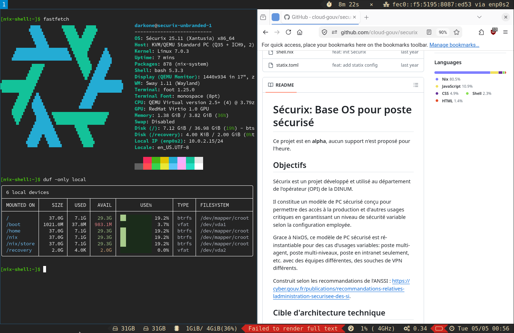

# Securix KVM / Qemu



## Utilisation

```bash
# Paramétrer
vim inventory/securix.nix
vim default.nix

# Construire l'ISO installateur
nix-build -A terminal.installer

# Lancer la VM avec l'ISO
nix-shell --run "run-securix-vm ./result/iso/*.iso"

# Lancer la VM
nix-shell --run "run-securix-vm"
```

## Développement avec un checkout local de securix

Par défaut, `securix` est pinné via `npins` sur la branche `securix-qemu-kvm` de
`github.com/darkone-linux/securix`. Pour pointer sur un checkout local :

```bash
export NPINS_OVERRIDE_SECURIX=../securix
nix-shell
```

## Mise à jour des sources

```bash
nix-shell --run "npins update"
```
